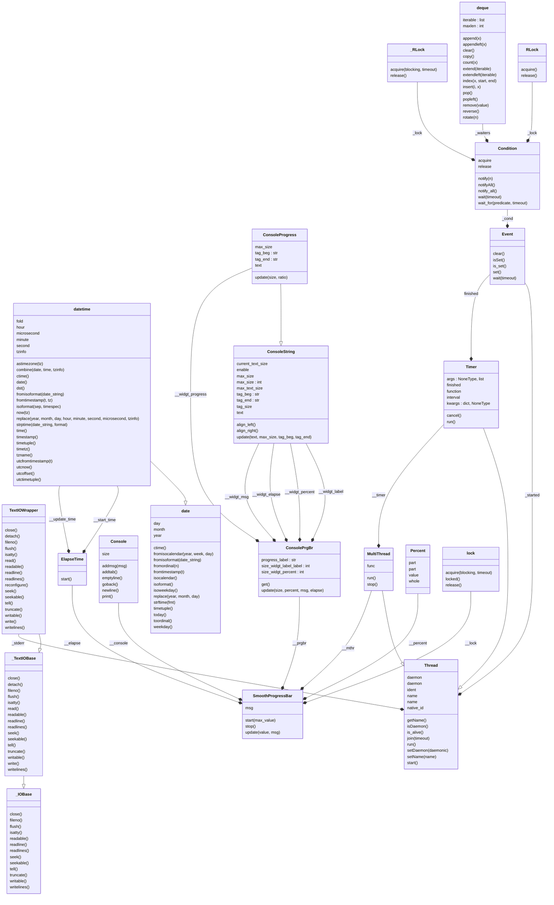

# smooth-progressbar.
[]()


## Description:


This progress bar is a tool that allows users to monitor the progress of
long-running tasks, such as data loading and cleaning, and make sure that 
the task is progressing as expected.
The progress bar can also be set to display a message or a comment alongside
the progress, providing more information about the current stage of the task.
This can be especially useful for debugging or troubleshooting. The library
includes examples, which can be found in the tests folder, that demonstrate 
how to use the progress bar in different contexts.
Additionally, the size of the progress bar is calculated according to the
terminal environment, so it will always fit the available space and be easy
to read. This feature makes it easy to integrate the progress bar into
different environments, whether you're working on a local machine or a 
remote server. Overall, this Python progress bar project is a useful tool 
for  anyone who wants to track the progress of a task or process, and make 
sure that it's running smoothly.

## Use:
```python
import time
from smoothprogressbar import SmoothProgressBar
my_progressbar = SmoothProgressBar()
my_progressbar.start(10)

for i in range(1, 11):
    my_progressbar.update(i, "task "+str(i))
    time.sleep(2)
my_progressbar.stop()
```

## Result:

    Processing (10.0%): |//                  | 0:00:01 | task 1
    Processing (20.0%): |////                | 0:00:03 | task 2
    Processing (30.0%): |//////              | 0:00:05 | task 3
    ...

# Setup:
- User:

Get the package:
```shell
git clone https://github.com/francois-le-ko4la/smooth-progressbar.git
```
Enter in the directory:
```shell
cd smooth-progressbar
```
Install with make on Linux/Unix/MacOS or use pip3 otherwise:
```shell
make install
```

- Dev environment:

Get the package:
```shell
git clone https://github.com/francois-le-ko4la/smooth-progressbar.git
```
Enter in the directory:
```shell
cd smooth-progressbar
```
Create your environment with all dev prerequisites and install the package:
```shell
make venv
source venv/bin/activate
make dev
```

# Test:
This module has been tested and validated on Ubuntu.
Test is available if you set up the package with dev environment.
```shell
make test
```

# License:
This package is distributed under the [GPLv3 license](./LICENSE)

# Todo:
- [X] Create the project
- [X] Write code and tests
- [X] Test installation and requirements (setup.py and/or Makefile)
- [X] Test code
- [X] Validate features
- [X] Write Doc/stringdoc
- [X] Run PEP8 validation
- [X] Clean & last check
- [X] Release

# Dev Notes


