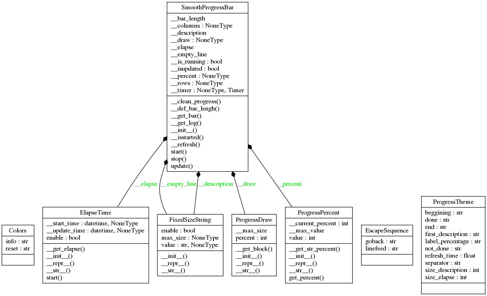

# smooth-progressbar
## Description:

This package provide a simple progress bar.

## Setup:
```shell
git clone https://github.com/francois-le-ko4la/smooth-progressbar.git
cd smooth-progressbar
make install
```

## Test:
```shell
make test
```

## Use:

```python
from smoothprogressbar import SmoothProgressBar
my_progressbar = SmoothProgressBar()
my_progressbar.start(10)

for i in range(1, 11):
    myPB.update(i, "task "+str(i))
    time.sleep(2)
my_progressbar.stop()
```

## Result:

    Processing (10.0%): |//                  | 0:00:01 | task 1
    Processing (20.0%): |////                | 0:00:03 | task 2
    Processing (30.0%): |//////              | 0:00:05 | task 3
    ...


## Project Structure
```
.
├── last_check.log
├── LICENSE
├── Makefile
├── MANIFEST.in
├── pictures
│   ├── classes_smooth-progressbar.png
│   └── packages_smooth-progressbar.png
├── README.md
├── requirements.txt
├── runtime.txt
├── setup.cfg
├── setup.py
├── smooth_progressbar
│   ├── __about__.py
│   ├── __init__.py
│   └── progressbar.py
└── tests
    ├── run_it.py
    ├── test_doctest.py
    └── test_pycodestyle.py
```

## Todo:

- [X] Create the project
- [X] Write code and tests
- [X] Test installation and requirements (setup.py and/or Makefile)
- [X] Test code
- [X] Validate features
- [X] Write Doc/stringdoc
- [X] Run PEP8 validation
- [ ] Clean & last check
- [ ] Release

## License

smooth-progressbar is distributed under the [GPLv3 license](./LICENSE)
## Dev notes
### Runtime

```
python-3.6.x

```
### Requirements

```
pycodestyle>=2.3.1
setuptools>=36.2.7

```
### UML Diagram


### Objects
[Colors()](#colors)<br />
[ElapseTime()](#elapsetime)<br />
[ElapseTime.__get_elapse(self)](#elapsetime__get_elapseself)<br />
[ElapseTime.__init__(self)](#elapsetimeinitself)<br />
[ElapseTime.__repr__(self)](#elapsetimereprself)<br />
[ElapseTime.__str__(self)](#elapsetimestrself)<br />
[ElapseTime.start(self)](#elapsetimestartself)<br />
[EscapeSequence()](#escapesequence)<br />
[FixedSizeString()](#fixedsizestring)<br />
[FixedSizeString.__init__(self, max_size)](#fixedsizestringinitself-max_size)<br />
[FixedSizeString.__repr__(self)](#fixedsizestringreprself)<br />
[FixedSizeString.__str__(self)](#fixedsizestringstrself)<br />
[ProgressDraw()](#progressdraw)<br />
[ProgressDraw.__get_block(self)](#progressdraw__get_blockself)<br />
[ProgressDraw.__init__(self, max_size)](#progressdrawinitself-max_size)<br />
[ProgressDraw.__repr__(self)](#progressdrawreprself)<br />
[ProgressDraw.__str__(self)](#progressdrawstrself)<br />
[ProgressPercent()](#progresspercent)<br />
[ProgressPercent.__get_str_percent(self)](#progresspercent__get_str_percentself)<br />
[ProgressPercent.__init__(self, max_value)](#progresspercentinitself-max_value)<br />
[ProgressPercent.__repr__(self)](#progresspercentreprself)<br />
[ProgressPercent.__str__(self)](#progresspercentstrself)<br />
[ProgressPercent.get_percent(self)](#progresspercentget_percentself)<br />
[ProgressTheme()](#progresstheme)<br />
[SmoothProgressBar()](#smoothprogressbar)<br />
[SmoothProgressBar.__clean_progress(self)](#smoothprogressbar__clean_progressself)<br />
[SmoothProgressBar.__def_bar_lengh(self)](#smoothprogressbar__def_bar_lenghself)<br />
[SmoothProgressBar.__get_bar(self)](#smoothprogressbar__get_barself)<br />
[SmoothProgressBar.__get_log(self)](#smoothprogressbar__get_logself)<br />
[SmoothProgressBar.__init__(self, enable_elapse=True, enable_description=True)](#smoothprogressbarinitself-enable_elapsetrue-enable_descriptiontrue)<br />
[SmoothProgressBar.__isstarted(status=True)](#smoothprogressbar__isstartedstatustrue)<br />
[SmoothProgressBar.__refresh(self)](#smoothprogressbar__refreshself)<br />
[SmoothProgressBar.start(self, max_value)](#smoothprogressbarstartself-max_value)<br />
[SmoothProgressBar.stop(self)](#smoothprogressbarstopself)<br />
[SmoothProgressBar.update(self, current_value, description=None)](#smoothprogressbarupdateself-current_value-descriptionnone)<br />


#### Colors()
```python
class Colors:
```

```
Docstring empty
```

#### ElapseTime()
```python
class ElapseTime(object):
```

```
Docstring empty
```

##### ElapseTime.__get_elapse(self)
```python
def ElapseTime.__get_elapse(self):
```
> <br />
> This function provides elapse time between start() and now.<br />
> <br />
> self.__update_time-self.__start_time<br />
> <br />
> <b>Args:</b><br />
> &nbsp;&nbsp;&nbsp;&nbsp;&nbsp;&nbsp;&nbsp;&nbsp;&nbsp;&nbsp;&nbsp;&nbsp;&nbsp;&nbsp;&nbsp;  None<br />
> <br />
> <b>Returns:</b><br />
> &nbsp;&nbsp;&nbsp;&nbsp;&nbsp;&nbsp;&nbsp;&nbsp;&nbsp;&nbsp;&nbsp;&nbsp;&nbsp;&nbsp;&nbsp;  datetime object<br />
> <br />
##### ElapseTime.__init__(self)
```python
def ElapseTime.__init__(self):
```
> <br />
> Init the default values<br />
> <br />
> <b>Args:</b><br />
> &nbsp;&nbsp;&nbsp;&nbsp;&nbsp;&nbsp;&nbsp;&nbsp;&nbsp;&nbsp;&nbsp;&nbsp;&nbsp;&nbsp;&nbsp;  None<br />
> <br />
> <b>Returns:</b><br />
> &nbsp;&nbsp;&nbsp;&nbsp;&nbsp;&nbsp;&nbsp;&nbsp;&nbsp;&nbsp;&nbsp;&nbsp;&nbsp;&nbsp;&nbsp;  obj<br />
> <br />
##### ElapseTime.__repr__(self)
```python
def ElapseTime.__repr__(self):
```
> <br />
> Provides the string<br />
> <br />
> <b>Args:</b><br />
> &nbsp;&nbsp;&nbsp;&nbsp;&nbsp;&nbsp;&nbsp;&nbsp;&nbsp;&nbsp;&nbsp;&nbsp;&nbsp;&nbsp;&nbsp;  None<br />
> <br />
> <b>Returns:</b><br />
> &nbsp;&nbsp;&nbsp;&nbsp;&nbsp;&nbsp;&nbsp;&nbsp;&nbsp;&nbsp;&nbsp;&nbsp;&nbsp;&nbsp;&nbsp;  None<br />
> <br />
##### ElapseTime.__str__(self)
```python
def ElapseTime.__str__(self):
```
> <br />
> Call repr<br />
> <br />
> <b>Args:</b><br />
> &nbsp;&nbsp;&nbsp;&nbsp;&nbsp;&nbsp;&nbsp;&nbsp;&nbsp;&nbsp;&nbsp;&nbsp;&nbsp;&nbsp;&nbsp;  None<br />
> <br />
> <b>Returns:</b><br />
> &nbsp;&nbsp;&nbsp;&nbsp;&nbsp;&nbsp;&nbsp;&nbsp;&nbsp;&nbsp;&nbsp;&nbsp;&nbsp;&nbsp;&nbsp;  None<br />
> <br />
##### ElapseTime.start(self)
```python
def ElapseTime.start(self):
```
> <br />
> Store the current timestamp in self.__start_time<br />
> <br />
> <b>Args:</b><br />
> &nbsp;&nbsp;&nbsp;&nbsp;&nbsp;&nbsp;&nbsp;&nbsp;&nbsp;&nbsp;&nbsp;&nbsp;&nbsp;&nbsp;&nbsp;  None<br />
> <br />
> <b>Returns:</b><br />
> &nbsp;&nbsp;&nbsp;&nbsp;&nbsp;&nbsp;&nbsp;&nbsp;&nbsp;&nbsp;&nbsp;&nbsp;&nbsp;&nbsp;&nbsp;  None<br />
> <br />
#### EscapeSequence()
```python
class EscapeSequence:
```

```
Docstring empty
```

#### FixedSizeString()
```python
class FixedSizeString(object):
```

```
Docstring empty
```

##### FixedSizeString.__init__(self, max_size)
```python
def FixedSizeString.__init__(self, max_size):
```
> <br />
> Initialize self.  See help(type(self)) for accurate signature.<br />
> <br />
##### FixedSizeString.__repr__(self)
```python
def FixedSizeString.__repr__(self):
```
> <br />
> Return repr(self).<br />
> <br />
##### FixedSizeString.__str__(self)
```python
def FixedSizeString.__str__(self):
```
> <br />
> call repr<br />
> <br />
> <b>Args:</b><br />
> &nbsp;&nbsp;&nbsp;&nbsp;&nbsp;&nbsp;&nbsp;&nbsp;&nbsp;&nbsp;&nbsp;&nbsp;&nbsp;&nbsp;&nbsp;  None<br />
> <br />
> <b>Returns:</b><br />
> &nbsp;&nbsp;&nbsp;&nbsp;&nbsp;&nbsp;&nbsp;&nbsp;&nbsp;&nbsp;&nbsp;&nbsp;&nbsp;&nbsp;&nbsp;  repr return<br />
> <br />
#### ProgressDraw()
```python
class ProgressDraw(object):
```

```
Use:
    >>> draw = ProgressDraw(10)
    >>> draw.percent = 0.1
    >>> print("<START>" + str(draw) + "<END>")
    <START>[#.........] <END>
    >>> draw.percent = 0.2
    >>> print("<START>" + str(draw) + "<END>")
    <START>[##........] <END>
    >>> draw.percent = 0.5
    >>> print("<START>" + str(draw) + "<END>")
    <START>[#####.....] <END>
    >>> draw.percent = 1
    >>> print("<START>" + str(draw) + "<END>")
    <START>[##########] <END>
```

##### ProgressDraw.__get_block(self)
```python
def ProgressDraw.__get_block(self):
```
> <br />
> Provides the number of block to print according to the progress<br />
> <br />
> <b>Args:</b><br />
> &nbsp;&nbsp;&nbsp;&nbsp;&nbsp;&nbsp;&nbsp;&nbsp;&nbsp;&nbsp;&nbsp;&nbsp;&nbsp;&nbsp;&nbsp;  None<br />
> <br />
> <b>Returns:</b><br />
> &nbsp;&nbsp;&nbsp;&nbsp;&nbsp;&nbsp;&nbsp;&nbsp;&nbsp;&nbsp;&nbsp;&nbsp;&nbsp;&nbsp;&nbsp;  int<br />
> <br />
##### ProgressDraw.__init__(self, max_size)
```python
def ProgressDraw.__init__(self, max_size):
```
> <br />
> Init the default value<br />
> Take the max size (100%)<br />
> <br />
> <b>Args:</b><br />
> &nbsp;&nbsp;&nbsp;&nbsp;&nbsp;&nbsp;&nbsp;&nbsp;&nbsp;&nbsp;&nbsp;&nbsp;&nbsp;&nbsp;&nbsp;  max_size (int): max size / 100%<br />
> <br />
> <b>Returns:</b><br />
> &nbsp;&nbsp;&nbsp;&nbsp;&nbsp;&nbsp;&nbsp;&nbsp;&nbsp;&nbsp;&nbsp;&nbsp;&nbsp;&nbsp;&nbsp;  obj<br />
> <br />
##### ProgressDraw.__repr__(self)
```python
def ProgressDraw.__repr__(self):
```
> <br />
> Provides the string to print<br />
> <br />
> <b>Args:</b><br />
> &nbsp;&nbsp;&nbsp;&nbsp;&nbsp;&nbsp;&nbsp;&nbsp;&nbsp;&nbsp;&nbsp;&nbsp;&nbsp;&nbsp;&nbsp;  None<br />
> <br />
> <b>Returns:</b><br />
> &nbsp;&nbsp;&nbsp;&nbsp;&nbsp;&nbsp;&nbsp;&nbsp;&nbsp;&nbsp;&nbsp;&nbsp;&nbsp;&nbsp;&nbsp;  str<br />
> <br />
##### ProgressDraw.__str__(self)
```python
def ProgressDraw.__str__(self):
```
> <br />
> call repr<br />
> <br />
> <b>Args:</b><br />
> &nbsp;&nbsp;&nbsp;&nbsp;&nbsp;&nbsp;&nbsp;&nbsp;&nbsp;&nbsp;&nbsp;&nbsp;&nbsp;&nbsp;&nbsp;  None<br />
> <br />
> <b>Returns:</b><br />
> &nbsp;&nbsp;&nbsp;&nbsp;&nbsp;&nbsp;&nbsp;&nbsp;&nbsp;&nbsp;&nbsp;&nbsp;&nbsp;&nbsp;&nbsp;  repr return<br />
> <br />
#### ProgressPercent()
```python
class ProgressPercent(object):
```

```
Provides the percentage indicator
Example:
    Processing : [ 40.0%]

Use:
    >>> percent = ProgressPercent(1000)
    >>> percent.value = 100
    >>> print(percent)
    Processing: [ 10.0%]
    >>> percent.value = 500
    >>> print(percent)
    Processing: [ 50.0%]
    >>> percent.value = 1000
    >>> print(percent)
    Processing: [ 100.%]
```

##### ProgressPercent.__get_str_percent(self)
```python
def ProgressPercent.__get_str_percent(self):
```
> <br />
> Provide the percentage / string - fixed size<br />
> <br />
> <b>Args:</b><br />
> &nbsp;&nbsp;&nbsp;&nbsp;&nbsp;&nbsp;&nbsp;&nbsp;&nbsp;&nbsp;&nbsp;&nbsp;&nbsp;&nbsp;&nbsp;  None<br />
> <br />
> <b>Returns:</b><br />
> &nbsp;&nbsp;&nbsp;&nbsp;&nbsp;&nbsp;&nbsp;&nbsp;&nbsp;&nbsp;&nbsp;&nbsp;&nbsp;&nbsp;&nbsp;  str<br />
> <br />
##### ProgressPercent.__init__(self, max_value)
```python
def ProgressPercent.__init__(self, max_value):
```
> <br />
> Init the default values<br />
> Take the max value to provide the percentage<br />
> <br />
> <b>Args:</b><br />
> &nbsp;&nbsp;&nbsp;&nbsp;&nbsp;&nbsp;&nbsp;&nbsp;&nbsp;&nbsp;&nbsp;&nbsp;&nbsp;&nbsp;&nbsp;  max_value (int): value at 100%<br />
> <br />
> <b>Returns:</b><br />
> &nbsp;&nbsp;&nbsp;&nbsp;&nbsp;&nbsp;&nbsp;&nbsp;&nbsp;&nbsp;&nbsp;&nbsp;&nbsp;&nbsp;&nbsp;  obj<br />
> <br />
##### ProgressPercent.__repr__(self)
```python
def ProgressPercent.__repr__(self):
```
> <br />
> Provide the string according to the %<br />
> <br />
> <b>Args:</b><br />
> &nbsp;&nbsp;&nbsp;&nbsp;&nbsp;&nbsp;&nbsp;&nbsp;&nbsp;&nbsp;&nbsp;&nbsp;&nbsp;&nbsp;&nbsp;  None<br />
> <br />
> <b>Returns:</b><br />
> &nbsp;&nbsp;&nbsp;&nbsp;&nbsp;&nbsp;&nbsp;&nbsp;&nbsp;&nbsp;&nbsp;&nbsp;&nbsp;&nbsp;&nbsp;  str<br />
> <br />
##### ProgressPercent.__str__(self)
```python
def ProgressPercent.__str__(self):
```
> <br />
> Call repr<br />
> <br />
> <b>Args:</b><br />
> &nbsp;&nbsp;&nbsp;&nbsp;&nbsp;&nbsp;&nbsp;&nbsp;&nbsp;&nbsp;&nbsp;&nbsp;&nbsp;&nbsp;&nbsp;  None<br />
> <br />
> <b>Returns:</b><br />
> &nbsp;&nbsp;&nbsp;&nbsp;&nbsp;&nbsp;&nbsp;&nbsp;&nbsp;&nbsp;&nbsp;&nbsp;&nbsp;&nbsp;&nbsp;  repr result<br />
> <br />
##### ProgressPercent.get_percent(self)
```python
def ProgressPercent.get_percent(self):
```
> <br />
> Calculates the percent value<br />
> <br />
> <b>Args:</b><br />
> &nbsp;&nbsp;&nbsp;&nbsp;&nbsp;&nbsp;&nbsp;&nbsp;&nbsp;&nbsp;&nbsp;&nbsp;&nbsp;&nbsp;&nbsp;  None<br />
> <br />
> <b>Returns:</b><br />
> &nbsp;&nbsp;&nbsp;&nbsp;&nbsp;&nbsp;&nbsp;&nbsp;&nbsp;&nbsp;&nbsp;&nbsp;&nbsp;&nbsp;&nbsp;  float<br />
> <br />
#### ProgressTheme()
```python
class ProgressTheme:
```

```
Docstring empty
```

#### SmoothProgressBar()
```python
class SmoothProgressBar(object):
```

```
This Class provides a progressbar
```

##### SmoothProgressBar.__clean_progress(self)
```python
def SmoothProgressBar.__clean_progress(self):
```
> <br />
> Docstring empty<br />
> <br />
##### SmoothProgressBar.__def_bar_lengh(self)
```python
def SmoothProgressBar.__def_bar_lengh(self):
```
> <br />
> Docstring empty<br />
> <br />
##### SmoothProgressBar.__get_bar(self)
```python
def SmoothProgressBar.__get_bar(self):
```
> <br />
> This function provides the string to print the progress and<br />
> informations<br />
> <br />
> <b>Args:</b><br />
> &nbsp;&nbsp;&nbsp;&nbsp;&nbsp;&nbsp;&nbsp;&nbsp;&nbsp;&nbsp;&nbsp;&nbsp;&nbsp;&nbsp;&nbsp;  None<br />
> <br />
> <b>Returns:</b><br />
> &nbsp;&nbsp;&nbsp;&nbsp;&nbsp;&nbsp;&nbsp;&nbsp;&nbsp;&nbsp;&nbsp;&nbsp;&nbsp;&nbsp;&nbsp;  string: Processing: [ 100.%] [#########] 0:00:20 - task 10<br />
> <br />
##### SmoothProgressBar.__get_log(self)
```python
def SmoothProgressBar.__get_log(self):
```
> <br />
> &nbsp;&nbsp;&nbsp;&nbsp;&nbsp;&nbsp;&nbsp;&nbsp;&nbsp;&nbsp;&nbsp;&nbsp;&nbsp;&nbsp;&nbsp;  &nbsp;&nbsp;&nbsp;&nbsp;&nbsp;&nbsp;&nbsp;&nbsp;&nbsp;&nbsp;&nbsp;&nbsp;&nbsp;&nbsp;&nbsp;  <br />
> <br />
##### SmoothProgressBar.__init__(self, enable_elapse=True, enable_description=True)
```python
def SmoothProgressBar.__init__(self, enable_elapse=True, enable_description=True):
```
> <br />
> Init the smoothProgressBar Class<br />
> <br />
> <b>Args:</b><br />
> &nbsp;&nbsp;&nbsp;&nbsp;&nbsp;&nbsp;&nbsp;&nbsp;&nbsp;&nbsp;&nbsp;&nbsp;&nbsp;&nbsp;&nbsp;  None<br />
> <br />
> <b>Attributes:</b><br />
> &nbsp;&nbsp;&nbsp;&nbsp;&nbsp;&nbsp;&nbsp;&nbsp;&nbsp;&nbsp;&nbsp;&nbsp;&nbsp;&nbsp;&nbsp;  self.__rows (float): screen size<br />
> &nbsp;&nbsp;&nbsp;&nbsp;&nbsp;&nbsp;&nbsp;&nbsp;&nbsp;&nbsp;&nbsp;&nbsp;&nbsp;&nbsp;&nbsp;  self.__columns (float): screen size<br />
> &nbsp;&nbsp;&nbsp;&nbsp;&nbsp;&nbsp;&nbsp;&nbsp;&nbsp;&nbsp;&nbsp;&nbsp;&nbsp;&nbsp;&nbsp;  self.__bar_length (int): progressbar size<br />
> &nbsp;&nbsp;&nbsp;&nbsp;&nbsp;&nbsp;&nbsp;&nbsp;&nbsp;&nbsp;&nbsp;&nbsp;&nbsp;&nbsp;&nbsp;  self.__description (str): task's description<br />
> &nbsp;&nbsp;&nbsp;&nbsp;&nbsp;&nbsp;&nbsp;&nbsp;&nbsp;&nbsp;&nbsp;&nbsp;&nbsp;&nbsp;&nbsp;  self.__is_running (bool)<br />
> &nbsp;&nbsp;&nbsp;&nbsp;&nbsp;&nbsp;&nbsp;&nbsp;&nbsp;&nbsp;&nbsp;&nbsp;&nbsp;&nbsp;&nbsp;  self.__percent (ProgressPercent)<br />
> &nbsp;&nbsp;&nbsp;&nbsp;&nbsp;&nbsp;&nbsp;&nbsp;&nbsp;&nbsp;&nbsp;&nbsp;&nbsp;&nbsp;&nbsp;  self.__draw (ProgressDraw)<br />
> &nbsp;&nbsp;&nbsp;&nbsp;&nbsp;&nbsp;&nbsp;&nbsp;&nbsp;&nbsp;&nbsp;&nbsp;&nbsp;&nbsp;&nbsp;  self.__elapse (ElapseTime)<br />
> &nbsp;&nbsp;&nbsp;&nbsp;&nbsp;&nbsp;&nbsp;&nbsp;&nbsp;&nbsp;&nbsp;&nbsp;&nbsp;&nbsp;&nbsp;  self.__timer (Timer): Thread<br />
> <br />
> <b>Returns:</b><br />
> &nbsp;&nbsp;&nbsp;&nbsp;&nbsp;&nbsp;&nbsp;&nbsp;&nbsp;&nbsp;&nbsp;&nbsp;&nbsp;&nbsp;&nbsp;  obj<br />
> <br />
##### SmoothProgressBar.__isstarted(status=True)
```python
def SmoothProgressBar.__isstarted(status=True):
```
> <br />
> Decorator to check progress bar status<br />
> <br />
> <b>Args:</b><br />
> &nbsp;&nbsp;&nbsp;&nbsp;&nbsp;&nbsp;&nbsp;&nbsp;&nbsp;&nbsp;&nbsp;&nbsp;&nbsp;&nbsp;&nbsp;  func: decorated function<br />
> &nbsp;&nbsp;&nbsp;&nbsp;&nbsp;&nbsp;&nbsp;&nbsp;&nbsp;&nbsp;&nbsp;&nbsp;&nbsp;&nbsp;&nbsp;  status (bool): The expected value.<br />
> <br />
> <b>Returns:</b><br />
> &nbsp;&nbsp;&nbsp;&nbsp;&nbsp;&nbsp;&nbsp;&nbsp;&nbsp;&nbsp;&nbsp;&nbsp;&nbsp;&nbsp;&nbsp;  func if self.__is_running = status<br />
> <br />
##### SmoothProgressBar.__refresh(self)
```python
@__isstarted(True)
def SmoothProgressBar.__refresh(self):
```
> <br />
> This function refresh the progress bar<br />
> <br />
> Call __get_bar(), print the string, call Timer functions to recall<br />
> <br />
> <b>Args:</b><br />
> &nbsp;&nbsp;&nbsp;&nbsp;&nbsp;&nbsp;&nbsp;&nbsp;&nbsp;&nbsp;&nbsp;&nbsp;&nbsp;&nbsp;&nbsp;  None<br />
> <br />
> <b>Returns:</b><br />
> &nbsp;&nbsp;&nbsp;&nbsp;&nbsp;&nbsp;&nbsp;&nbsp;&nbsp;&nbsp;&nbsp;&nbsp;&nbsp;&nbsp;&nbsp;  None<br />
> <br />
##### SmoothProgressBar.start(self, max_value)
```python
@__isstarted(False)
def SmoothProgressBar.start(self, max_value):
```
> <br />
> This function start the progress bar<br />
> <br />
> Test if the progress is already running, set _startTime,<br />
> call Timer functions to refresh<br />
> <br />
> <b>Args:</b><br />
> &nbsp;&nbsp;&nbsp;&nbsp;&nbsp;&nbsp;&nbsp;&nbsp;&nbsp;&nbsp;&nbsp;&nbsp;&nbsp;&nbsp;&nbsp;  max_value (int): the value at 100%.<br />
> <br />
> <b>Returns:</b><br />
> &nbsp;&nbsp;&nbsp;&nbsp;&nbsp;&nbsp;&nbsp;&nbsp;&nbsp;&nbsp;&nbsp;&nbsp;&nbsp;&nbsp;&nbsp;  None<br />
> <br />
##### SmoothProgressBar.stop(self)
```python
@__isstarted(True)
def SmoothProgressBar.stop(self):
```
> <br />
> This function stop the progress bar.<br />
> <br />
> <b>Args:</b><br />
> &nbsp;&nbsp;&nbsp;&nbsp;&nbsp;&nbsp;&nbsp;&nbsp;&nbsp;&nbsp;&nbsp;&nbsp;&nbsp;&nbsp;&nbsp;  None<br />
> <br />
> <b>Results:</b><br />
> &nbsp;&nbsp;&nbsp;&nbsp;&nbsp;&nbsp;&nbsp;&nbsp;&nbsp;&nbsp;&nbsp;&nbsp;&nbsp;&nbsp;&nbsp;  None<br />
> <br />
##### SmoothProgressBar.update(self, current_value, description=None)
```python
@__isstarted(True)
def SmoothProgressBar.update(self, current_value, description=None):
```
> <br />
> This function update currentValue & description<br />
> <br />
> <b>Args:</b><br />
> &nbsp;&nbsp;&nbsp;&nbsp;&nbsp;&nbsp;&nbsp;&nbsp;&nbsp;&nbsp;&nbsp;&nbsp;&nbsp;&nbsp;&nbsp;  current_value (int): current value<br />
> &nbsp;&nbsp;&nbsp;&nbsp;&nbsp;&nbsp;&nbsp;&nbsp;&nbsp;&nbsp;&nbsp;&nbsp;&nbsp;&nbsp;&nbsp;  description (string): current description<br />
> <br />
> <b>Returns:</b><br />
> &nbsp;&nbsp;&nbsp;&nbsp;&nbsp;&nbsp;&nbsp;&nbsp;&nbsp;&nbsp;&nbsp;&nbsp;&nbsp;&nbsp;&nbsp;  None<br />
> <br />
