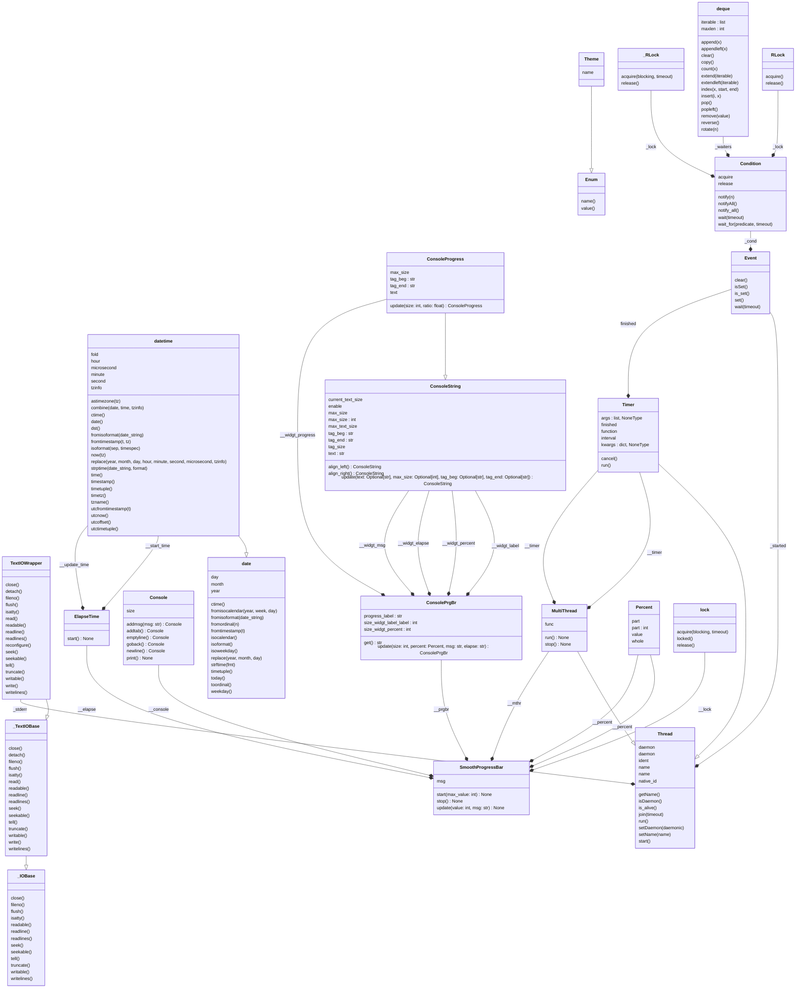

<p align="center">
  
  
  
  <br />
  
  
  
  
  
  
</p>

# smooth-progressbar:


# Description:
This progress bar is a tool that allows users to monitor the progress of
long-running tasks, such as data loading and cleaning, and make sure that
the task is progressing as expected.
The progress bar can also be set to display a message or a comment
alongside the progress, providing more information about the current
stage of the task.
This can be especially useful for debugging or troubleshooting. The library
includes examples, which can be found in the tests folder, that demonstrate
how to use the progress bar in different contexts.
Additionally, the size of the progress bar is calculated according to the
terminal environment, so it will always fit the available space and be easy
to read. This feature makes it easy to integrate the progress bar into
different environments, whether you're working on a local machine or a
remote server. Overall, this Python progress bar project is a useful tool
for  anyone who wants to track the progress of a task or process, and make
sure that it's running smoothly.

# Use:
```python
import time
from smoothprogressbar import SmoothProgressBar
my_progressbar = SmoothProgressBar()
my_progressbar.start(10)

for i in range(1, 11):
    my_progressbar.update(i, "task "+str(i))
    time.sleep(2)
my_progressbar.stop()
```

# Compatibility:
Python 3.7+

# Setup:
- User:

Get the package:
```shell
git clone https://github.com/francois-le-ko4la/smooth-progressbar.git
```
Change to the folder:
```shell
cd smooth-progressbar
```
Install with make on Linux/Unix/MacOS or use pip3 otherwise:
```shell
make install
```

- Dev environment:

Get the package:
```shell
git clone https://github.com/francois-le-ko4la/smooth-progressbar.git
```
Change to the folder:
```shell
cd smooth-progressbar
```
Create your environment with all dev prerequisites and install the package:
```shell
make venv
source venv/bin/activate
make dev
```

# Test:
This module has been tested and validated on Ubuntu.
Test is available if you set up the package with dev environment.
```shell
make test
```

# License:
This package is distributed under the [GPLv3 license](./LICENSE)
# Todo:
- [X] Create the project
- [X] Write code and tests
- [X] Test installation and requirements (setup.py and/or Makefile)
- [X] Test code
- [X] Validate features
- [X] Write Doc/stringdoc
- [X] Run PEP8 validation
- [X] Clean & last check
- [X] Release 0.3.0
- [X] add stubs
- [X] update pyproject.toml
- [X] update doc
- [X] Release 0.3.1

# Dev notes
## TOML file:

```toml

# -*- coding: utf-8 -*-
[project]
name = "smoothprogressbar"
version = "0.3.1"
authors = [
  {name = "ko4la" }
]
description = "Smoothprogressbar."
license = {file = "LICENSE"}
readme = "README.md"
requires-python = ">=3.7"
classifiers = [
    "Development Status :: 5 - Stable",
    "Environment :: Console",
    "Intended Audience :: Developers",
    "Programming Language :: Python :: 3",
    "Programming Language :: Python :: 3.7",
    "Programming Language :: Python :: 3.8",
    "Programming Language :: Python :: 3.9",
    "Programming Language :: Python :: 3.10",
    "Programming Language :: Python :: 3.11",
    "Programming Language :: Python :: 3 :: Only",
    "OSI Approved :: GNU General Public License v3 (GPLv3)",
]
dependencies = [
    "importlib-metadata ~= 1.0 ; python_version < '3.8'"
    ]

[project.optional-dependencies]
dev = [
    "pycodestyle>=2.3.1",
    "pytest>=7.2.0",
    "pylint",
    "mypy",
    "pydocstyle",
    "pytest-pylint",
    "pytest-pycodestyle",
    "pytest-mypy",
    "pytest-pydocstyle",
    "pytest-isort",
    "types-setuptools"]

[project.urls]
"Homepage" = "https://github.com/francois-le-ko4la/smooth-progressbar"

[build-system]
requires = ["setuptools"]
build-backend = "setuptools.build_meta"

[tool.pytest.ini_options]
minversion = "7.2"
addopts = [
    "-v",
    "--pycodestyle",
    "--doctest-modules",
    "--mypy",
    "--pydocstyle",
    "--pylint",
    "--isort",
    "--strict-markers"
]
xfail_strict = true
filterwarnings = [
    "ignore:.*U.*mode is deprecated:DeprecationWarning",
    "ignore::DeprecationWarning"]

[tool.mypy]
disallow_any_generics = true
disallow_untyped_defs = true
warn_redundant_casts = true
strict_equality = true


```
## UML Diagram:


## Objects:

[Theme()](#theme)<br />
[Console()](#console)<br />
[@Property Console.size()](#property-consolesize)<br />
[Console.addmsg()](#consoleaddmsg)<br />
[Console.emptyline()](#consoleemptyline)<br />
[Console.addtab()](#consoleaddtab)<br />
[Console.goback()](#consolegoback)<br />
[Console.newline()](#consolenewline)<br />
[Console.print()](#consoleprint)<br />
[ConsolePrgBr()](#consoleprgbr)<br />
[ConsolePrgBr.update()](#consoleprgbrupdate)<br />
[ConsolePrgBr.get()](#consoleprgbrget)<br />
[ConsoleProgress()](#consoleprogress)<br />
[ConsoleProgress.update()](#consoleprogressupdate)<br />
[ConsoleString()](#consolestring)<br />
[@Property ConsoleString.enable()](#property-consolestringenable)<br />
[@Property ConsoleString.max_size()](#property-consolestringmax_size)<br />
[ConsoleString.max_size()](#consolestringmax_size)<br />
[@Property ConsoleString.tag_size()](#property-consolestringtag_size)<br />
[@Property ConsoleString.max_text_size()](#property-consolestringmax_text_size)<br />
[@Property ConsoleString.current_text_size()](#property-consolestringcurrent_text_size)<br />
[ConsoleString.align_left()](#consolestringalign_left)<br />
[ConsoleString.align_right()](#consolestringalign_right)<br />
[ConsoleString.update()](#consolestringupdate)<br />
[ElapseTime()](#elapsetime)<br />
[ElapseTime.start()](#elapsetimestart)<br />
[MultiThread()](#multithread)<br />
[@Property MultiThread.func()](#property-multithreadfunc)<br />
[MultiThread.run()](#multithreadrun)<br />
[MultiThread.stop()](#multithreadstop)<br />
[Percent()](#percent)<br />
[@Property Percent.whole()](#property-percentwhole)<br />
[@Property Percent.part()](#property-percentpart)<br />
[Percent.part()](#percentpart)<br />
[@Property Percent.value()](#property-percentvalue)<br />
[SmoothProgressBar()](#smoothprogressbar)<br />
[@Property SmoothProgressBar.msg()](#property-smoothprogressbarmsg)<br />
[SmoothProgressBar.msg()](#smoothprogressbarmsg)<br />
[SmoothProgressBar.start()](#smoothprogressbarstart)<br />
[SmoothProgressBar.stop()](#smoothprogressbarstop)<br />
[SmoothProgressBar.update()](#smoothprogressbarupdate)<br />
### Theme()
```python
class Theme(Enum):
```
<pre>

Define constants.

</pre>
### Console()
```python
class Console():
```
<pre>

This Class provides a simple way to manage the screen.

<b>Use:</b>
    >>> c = Console()
    >>> c.addmsg("lorem ipsum dolor").print()
    lorem ipsum dolor
    >>> c.addmsg("lorem ipsum dolor").newline().addmsg("LOREM").print()
    lorem ipsum dolor
    LOREM

</pre>
#### @Property Console.size()
```python
@property
def Console.size(self) -> int:
```
<pre>

Get screen size.

</pre>
#### Console.addmsg()
```python
def Console.addmsg(self, msg: str) -> Console:
```
<pre>

Store a message.

</pre>
#### Console.emptyline()
```python
def Console.emptyline(self) -> Console:
```
<pre>

Add an empty line.

</pre>
#### Console.addtab()
```python
def Console.addtab(self) -> Console:
```
<pre>

Add tab.

</pre>
#### Console.goback()
```python
def Console.goback(self) -> Console:
```
<pre>

Go back.

</pre>
#### Console.newline()
```python
def Console.newline(self) -> Console:
```
<pre>

Add a new line.

</pre>
#### Console.print()
```python
def Console.print(self) -> None:
```
<pre>

Print the buffer.

</pre>
### ConsolePrgBr()
```python
class ConsolePrgBr():
```
<pre>

This class print all components according to parameters.

<b>Use:</b>
>>> from smoothprogressbar.percent import Percent
>>> from smoothprogressbar.elapse import ElapseTime
>>> size = 40
>>> percent = Percent(10)
>>> percent.part = 2
>>> msg = "lorem ipsum dolor sit amet consectetur adipiscing elit"
>>> elapse = ElapseTime()
>>> elapse.start()
>>> prgbr = ConsolePrgBr(debug=True)
>>> prgbr.update(size, percent, msg, str(elapse)).get()
'Processing: [ 20.0%] [...] 0:00:00 lorem'
>>> size = 70
>>> prgbr = ConsolePrgBr(debug=True)
>>> prgbr.update(size, percent, msg, str(elapse)).get()
'Processing: [ 20.0%] [###...............] 0:00:00 lorem ipsum dolor si'
>>> prgbr = ConsolePrgBr(enable_elapse=False, enable_msg=False, debug=True)
>>> prgbr.update(size, percent, msg, str(elapse)).get()
'Processing: [ 20.0%] [#########......................................]'
>>> prgbr = ConsolePrgBr(enable_elapse=True, enable_msg=False, debug=True)
>>> prgbr.update(size, percent, msg, str(elapse)).get()
'Processing: [ 20.0%] [#######................................] 0:00:00'
>>> prgbr = ConsolePrgBr(enable_elapse=False, enable_msg=True, debug=True)
>>> prgbr.update(size, percent, msg, str(elapse)).get()
'Processing: [ 20.0%] [####..................] lorem ipsum dolor sit am'

</pre>
#### ConsolePrgBr.update()
```python
def ConsolePrgBr.update(self, size: int, percent: Percent, msg: str = "", elapse: str = "") -> ConsolePrgBr:
```
<pre>

Update the progress bar.

</pre>
#### ConsolePrgBr.get()
```python
def ConsolePrgBr.get(self) -> str:
```
<pre>

Get the string.

</pre>
### ConsoleProgress()
```python
class ConsoleProgress(ConsoleString):
```
<pre>

Define ConsoleProgress.

<b>Use:</b>
    >>> c = ConsoleProgress()
    >>> str(c.update(12, 0.1))
    '[#.........]'
    >>> str(c.update(12, 0.4))
    '[####......]'
    >>> str(c.update(12, 1))
    '[##########]'
    >>> len(c.update(12, 1))
    12

</pre>
#### ConsoleProgress.update()
```python
def ConsoleProgress.update(self, size: int, ratio: float) -> ConsoleProgress:
```
<pre>

Update.

</pre>
### ConsoleString()
```python
class ConsoleString():
```
<pre>

Print messages.

Console string is a string to print (stdout) with
fixed size.

'[XXXXXXXXX ]                  '
 -          -                    : tag size
  ----------                     : text size
|------------------------------| : max size

<b>Why:</b>
    It's usefull to manage the screen size.

<b>Use:</b>
    >>> c = ConsoleString("lorem", max_size=3)
    >>> c
    lor
    >>> c = ConsoleString("lorem")
    >>> # tag
    >>> c.tag_beg = "["
    >>> c.tag_end="]"
    >>> for i in range(9): c.max_size = i ; str(c)
    ''
    '['
    '[]'
    '[l]'
    '[lo]'
    '[lor]'
    '[lore]'
    '[lorem]'
    '[lorem] '
    >>> len(c)
    8
    >>> c.text
    'lorem'
    >>> c = ConsoleString("lorem")
    >>> for i in range(9): c.max_size = i ; str(c.align_left())
    ''
    'l'
    'lo'
    'lor'
    'lore'
    'lorem'
    'lorem '
    'lorem  '
    'lorem   '
    >>> c = ConsoleString("lorem")
    >>> for i in range(9): c.max_size = i ; str(c.align_right())
    ''
    'l'
    'lo'
    'lor'
    'lore'
    'lorem'
    ' lorem'
    '  lorem'
    '   lorem'
    >>> txt = "lorem ipsum dolor sit amet consectetur adipiscing elit"
    >>> str(c.update(text=txt, max_size=15, tag_beg="*** "))
    '*** lorem ipsum'

</pre>
#### @Property ConsoleString.enable()
```python
@property
def ConsoleString.enable(self) -> bool:
```
<pre>

Get enable.

</pre>
#### @Property ConsoleString.max_size()
```python
@property
def ConsoleString.max_size(self) -> int:
```
<pre>

Get max size.

</pre>
#### ConsoleString.max_size()
```python
@max_size.setter
def ConsoleString.max_size(self, value: int) -> None:
```
<pre>

Set max size.

</pre>
#### @Property ConsoleString.tag_size()
```python
@property
def ConsoleString.tag_size(self) -> int:
```
<pre>

Get tag_size.

</pre>
#### @Property ConsoleString.max_text_size()
```python
@property
def ConsoleString.max_text_size(self) -> int:
```
<pre>

Get max_text_size.

</pre>
#### @Property ConsoleString.current_text_size()
```python
@property
def ConsoleString.current_text_size(self) -> int:
```
<pre>

Get current_text_size.

</pre>
#### ConsoleString.align_left()
```python
def ConsoleString.align_left(self) -> ConsoleString:
```
<pre>

Apply 'align-left' to the string.

</pre>
#### ConsoleString.align_right()
```python
def ConsoleString.align_right(self) -> ConsoleString:
```
<pre>

Apply 'align-right' to the string.

</pre>
#### ConsoleString.update()
```python
def ConsoleString.update(self, text: Optional[str] = None, max_size: Optional[int] = None, tag_beg: Optional[str] = None, tag_end: Optional[str] = None) -> ConsoleString:
```
<pre>

Update the string.

</pre>
### ElapseTime()
```python
class ElapseTime():
```
<pre>

Calculate elapse time.

<b>Use:</b>
    >>> import time
    >>> t = ElapseTime()
    >>> #oups...
    >>> t
    Traceback (most recent call last):
    ...
    RuntimeError: start before...
    >>> t.start()
    >>> time.sleep(1)
    >>> t
    0:00:01
    >>> time.sleep(1)
    >>> t
    0:00:02
    >>> str(t)
    '0:00:02'

</pre>
#### ElapseTime.start()
```python
def ElapseTime.start(self) -> None:
```
<pre>

Store the current timestamp in self.__start_time.

<b>Returns:</b>
    None

</pre>
### MultiThread()
```python
class MultiThread(Thread):
```
<pre>

A class that represents a thread of control.

This is used to refresh the progressbar regurarly. (self.__refresh())
<b>This class subclassed Thread class :</b>
    class Thread(builtins.object)

We specify the activity by passing a callable object to the constructor.

<b>Use:</b>
    >>> import time
    >>> def mytask(): print("lorem ipsum dolor sit amet consectetur")
    >>> mthr = MultiThread(mytask, 0.1)
    >>> mthr.start() ; print("other task");time.sleep(0.3) ; mthr.stop()
    lorem ipsum dolor sit amet consectetur
    other task
    lorem ipsum dolor sit amet consectetur
    lorem ipsum dolor sit amet consectetur

</pre>
#### @Property MultiThread.func()
```python
@property
def MultiThread.func(self) -> Callable[[], None]:
```
<pre>

Get func.

Returns the callable object defined by Thread constructor.

<b>Returns:</b>
    Callable[[], None]: callable object

</pre>
#### MultiThread.run()
```python
def MultiThread.run(self) -> None:
```
<pre>

Do tasks.

Method (override) representing the thread's activity.
This method will raise a RuntimeError if called more than once on the
same thread object.

<b>Returns:</b>
    None.

</pre>
#### MultiThread.stop()
```python
def MultiThread.stop(self) -> None:
```
<pre>

Stop multithreading.

Wait until the thread terminates.
This blocks the calling thread until the thread whose join() method is
called terminates -- either normally or through an unhandled exception.

<b>Returns:</b>
    None.

</pre>
### Percent()
```python
class Percent(float):
```
<pre>

Calc percent.

<b>Use:</b>
    >>> p = Percent(10)
    >>> p.part = 2
    >>> p.part
    2
    >>> p
     20.0%
    >>> str(p)
    ' 20.0%'
    >>> p.value
    0.2
    >>> p = Percent(8)
    >>> for i in range(9): p.part = i ; print("{}-{}".format(p, p.value))
      0.0%-0.0
     12.5%-0.125
     25.0%-0.25
     37.5%-0.375
     50.0%-0.5
     62.5%-0.625
     75.0%-0.75
     87.5%-0.875
    100.0%-1.0

</pre>
#### @Property Percent.whole()
```python
@property
def Percent.whole(self) -> float:
```
<pre>

Get whole.

<b>Returns:</b>
    float: X% = 100 * (part / whole)

</pre>
#### @Property Percent.part()
```python
@property
def Percent.part(self) -> int:
```
<pre>

Get part.

<b>Returns:</b>
    int: X% = 100 * (part / whole)

</pre>
#### Percent.part()
```python
@part.setter
def Percent.part(self, value: int) -> None:
```
<pre>

Set part.

</pre>
#### @Property Percent.value()
```python
@property
def Percent.value(self) -> float:
```
<pre>

Get Value.

<b>Returns:</b>
    float: value = X%/100 = part / whole

</pre>
### SmoothProgressBar()
```python
class SmoothProgressBar():
```
<pre>

This class use all others component to manage the progressbar.

</pre>
#### @Property SmoothProgressBar.msg()
```python
@property
def SmoothProgressBar.msg(self) -> str:
```
<pre>

Get message.

</pre>
#### SmoothProgressBar.msg()
```python
@msg.setter
def SmoothProgressBar.msg(self, msg: str) -> None:
```
<pre>

Set message.

</pre>
#### SmoothProgressBar.start()
```python
def SmoothProgressBar.start(self, max_value: int) -> None:
```
<pre>

Start the progress bar.

init percent(), screen size, elapse & multithreading

</pre>
#### SmoothProgressBar.stop()
```python
def SmoothProgressBar.stop(self) -> None:
```
<pre>

Stop the progress bar.

</pre>
#### SmoothProgressBar.update()
```python
def SmoothProgressBar.update(self, value: int, msg: str = "") -> None:
```
<pre>

Update the progressbar.

</pre>
